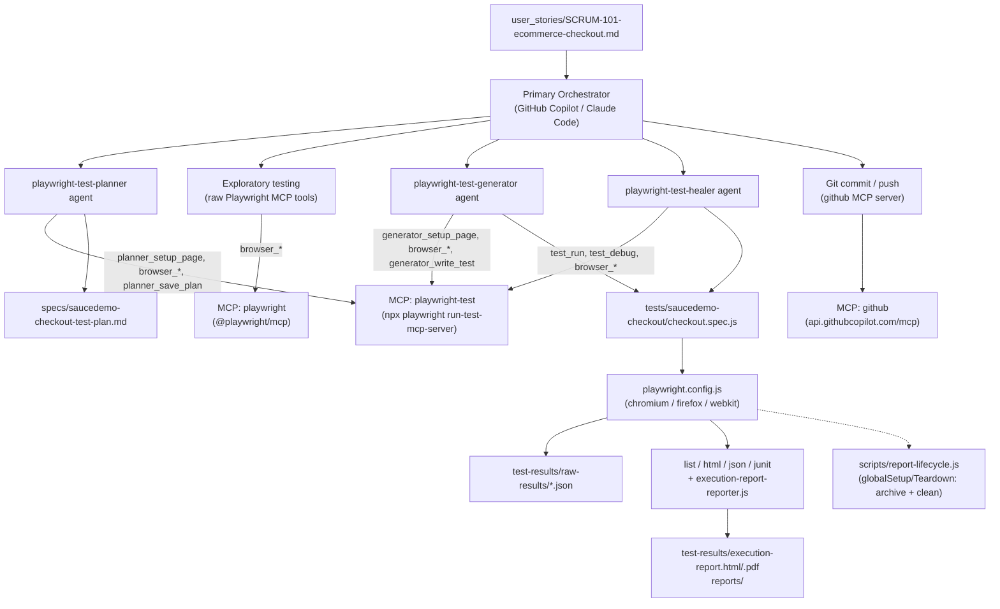
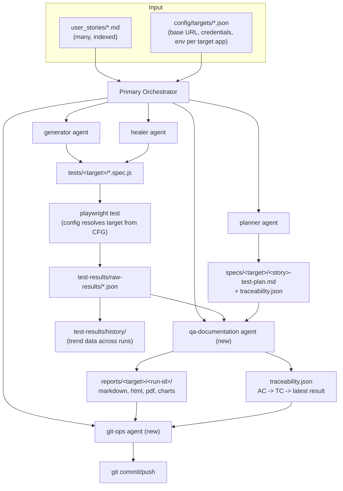

# Architecture

This document describes the current architecture and the target architecture it should evolve into.
See [PROJECT_VISION.md](PROJECT_VISION.md) for why, and [ROADMAP.md](ROADMAP.md) for the phased path to get there.

## Current architecture

### Layers, as they exist now

1. **Input layer** — a single Markdown user story in `user_stories/`. Read manually/by-agent at the start of a
   run; no schema, no index of multiple stories.
2. **Orchestration layer** — `Prompt_E2E.md` is the script the orchestrator follows: 7 fixed steps, executed
   sequentially, no branching.
3. **Agent layer** — three agents defined as `.agent.md` files in `.github/agents/`, each pinned to a fixed tool
   list and a single MCP server (`playwright-test`). "qa-documentation-agent" and "GitHub MCP Server" appear as
   named responsibilities in `Prompt_E2E.md` but have **no corresponding agent definition** — today those steps
   are covered by plain Node scripts and manual git operations, not agents.
4. **MCP/tool layer** — three servers configured in [.vscode/mcp.json](.vscode/mcp.json): `playwright-test`
   (test authoring/execution), `playwright` (general browser driving, used only for the exploratory step), and
   `github` (repo operations). Two different Playwright MCP servers exist side by side because the test agents
   need authoring tools (`generator_write_test`, `test_debug`, …) that the general browser server doesn't expose.
5. **Execution layer** — [playwright.config.js](playwright.config.js): 3 browser projects, screenshots/video/trace
   on failure, `globalSetup`/`globalTeardown` hooks into [scripts/report-lifecycle.js](scripts/report-lifecycle.js)
   which archives the previous run (optionally, under `REPORT_HISTORY=true`) and resets `test-results/`,
   `playwright-report/`, `reports/` before each run.
6. **Reporting layer** — a custom reporter ([scripts/execution-report-reporter.js](scripts/execution-report-reporter.js))
   runs alongside the built-in html/json/junit reporters and writes per-test-case JSON into
   `test-results/raw-results/`. [scripts/report-utils.js](scripts/report-utils.js) (the largest file in the
   project) turns that data into the HTML dashboard and charts. `npm run report:pdf` /
   `npm run report:excel` are separate, manually-invoked scripts, not part of the automatic pipeline.
7. **Delivery layer** — a plain `git add/commit/push`, described in `Prompt_E2E.md` as being done via the
   `github` MCP server, following a fixed commit message template.
8. **CI** — [.github/workflows/playwright.yml](.github/workflows/playwright.yml) only runs `npx playwright test`
   on push/PR. It does **not** run the agent pipeline (planner/generator/healer) — CI validates the
   already-generated suite, it doesn't regenerate or heal it.

### Known coupling / gaps (the reason a target architecture is needed)

- **Everything is hardcoded to SauceDemo.** Base URL, credentials, and selector fallback lists are written
  directly into [tests/saucedemo-checkout/checkout.spec.js](tests/saucedemo-checkout/checkout.spec.js) rather
  than sourced from the plan or from config. There is no way to point today's agents at a second application
  without editing agent-adjacent code.
- **Multi-selector fallback arrays** (e.g. four candidate selectors per field) exist in the generated spec
  because there's no stable selector contract flowing from planner → generator. The generator should be able to
  trust one selector per element if the planner had recorded it authoritatively.
- **No traceability data structure.** Acceptance criteria, test case IDs, and execution results are connected
  only by naming convention (`TC-001`, `SCRUM-101`) across separate Markdown/JSON files, not by an explicit,
  queryable link.
- **Documentation/reporting and git-ops are responsibilities without agents.** They're named in `Prompt_E2E.md`
  but implemented as scripts + manual steps, which is the opposite of every other phase.
- **Single-story, single-run design.** There's no concept of a backlog of user stories or of comparing runs
  over time beyond the `history/` archive `report-lifecycle.js` already scaffolds.

## Target architecture

### What changes

- **Config-driven targets.** A `config/targets/<name>.json` (base URL, test credentials, environment) becomes a
  first-class input alongside the user story. Agents read the target from config instead of literal strings in
  spec files. This is the single highest-leverage change toward the vision's "no code changes per app" goal.
- **A real selector/data contract between planner and generator.** The planner's saved plan should record the
  selector or accessible name it actually used for each interactive element, so the generator has one
  authoritative source instead of guessing fallbacks.
- **Two new agents formalize existing informal steps** (documentation/reporting, git operations) — see
  [ROADMAP.md](ROADMAP.md) for when. Per current instructions, these are **not** being created yet; this
  document only describes where they'd sit.
- **A traceability artifact** (`traceability.json` or similar), generated once by the planner (AC → TC) and
  updated by the documentation step (TC → latest result), replacing convention-only linking.
- **Multi-story orchestration.** The orchestrator can iterate over a backlog of user stories under
  `user_stories/`, running the same pipeline per story into per-story `specs/`/`tests/`/`reports/` subfolders.
- **History becomes first-class.** `report-lifecycle.js`'s existing `history/` archiving is already
  future-facing; the target architecture leans on it for trend charts (flake rate, healing success rate over
  time) instead of treating each run in isolation.

### Non-changes

The three existing agents' internal responsibilities and their reliance on live-browser MCP interaction stay as
they are — that split (plan via live exploration → generate via live replay → heal via live debugging) is the
part of the current design that's already working and is not being revisited.
clk