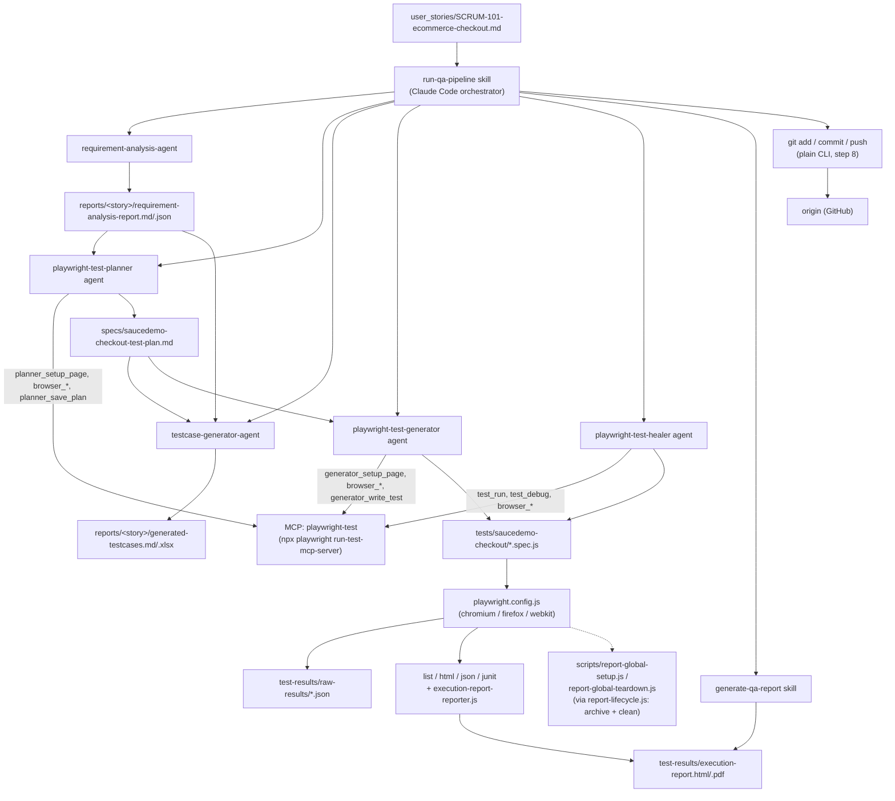
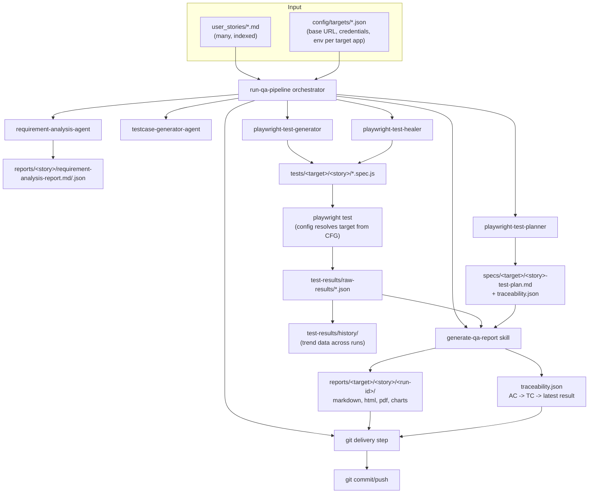

# Architecture

This document describes the current architecture and the target architecture it should evolve into.
See [PROJECT_VISION.md](PROJECT_VISION.md) for why, and [ROADMAP.md](ROADMAP.md) for the phased path to get there.

## Current architecture

### Layers, as they exist now

1. **Input layer** — a single Markdown user story in `user_stories/`. Read by the orchestrator at the start of a
   run; no schema, no index of multiple stories.
2. **Orchestration layer** — [`.claude/skills/run-qa-pipeline/SKILL.md`](.claude/skills/run-qa-pipeline/SKILL.md)
   is the script the orchestrator (Claude Code) follows: 8 sequential steps with three human approval
   checkpoints (after the requirement analysis report, after the test plan, after the manual test cases), no
   branching. This supersedes the project's earlier GitHub-Copilot/`Prompt_E2E.md`-driven design, which has
   been retired.
3. **Agent layer** — five agents defined as `.md` files in [`.claude/agents/`](.claude/agents/), each pinned to a
   single responsibility per [CLAUDE.md](CLAUDE.md): `requirement-analysis-agent` and `testcase-generator-agent`
   are pure Read/Write (no browser, no MCP); `playwright-test-planner`, `playwright-test-generator`, and
   `playwright-test-healer` are each pinned to the `playwright-test` MCP server. Reporting and git delivery are
   **not** separate agents — they're steps 7 and 8 of the `run-qa-pipeline` skill (reporting also has its own
   standalone skill, [`generate-qa-report`](.claude/skills/generate-qa-report/SKILL.md)), which matches CLAUDE.md's
   "One Skill, One Capability" principle rather than needing a dedicated subagent for every step.
4. **MCP/tool layer** — [`.mcp.json`](.mcp.json) configures the servers Claude Code actually uses: `playwright-test`
   (test authoring/execution — used by the planner, generator, and healer), `playwright` (general browser
   driving, currently unused by the pipeline agents since they all use `playwright-test`'s own `browser_*`
   tools), `github` (repo operations, configured but not what git delivery currently goes through — step 8 uses
   plain `git` CLI commands), and `claude` (Anthropic API access, not consumed by the QA pipeline today). A
   second, overlapping config file, [`.vscode/mcp.json`](.vscode/mcp.json), also exists as a leftover from the
   project's earlier VS Code/GitHub Copilot setup — nothing keeps the two files in sync, which is a latent gap
   (see below).
5. **Execution layer** — [playwright.config.js](playwright.config.js): 3 browser projects, screenshots/video/trace
   on failure, `globalSetup`/`globalTeardown` hooks into
   [scripts/report-global-setup.js](scripts/report-global-setup.js) /
   [scripts/report-global-teardown.js](scripts/report-global-teardown.js), which build on
   [scripts/report-lifecycle.js](scripts/report-lifecycle.js) to archive the previous run (optionally, under
   `REPORT_HISTORY=true`) and reset `test-results/`, `playwright-report/` before each run.
6. **Reporting layer** — a custom reporter ([scripts/execution-report-reporter.js](scripts/execution-report-reporter.js))
   runs alongside the built-in html/json/junit reporters and writes per-test-case JSON into
   `test-results/raw-results/`. [scripts/report-utils.js](scripts/report-utils.js) turns that data into the HTML
   dashboard and charts. `npm run report:pdf` / `npm run report:excel` ([scripts/generate-report.js](scripts/generate-report.js),
   [scripts/generate-test-case-workbook.js](scripts/generate-test-case-workbook.js)) are invoked via the
   `generate-qa-report` skill as step 7 of the pipeline — still separate scripts per output format, by design
   (see Known gaps).
7. **Delivery layer** — a plain `git add`/`commit`/`push` run directly by the orchestrator (step 8 of
   `run-qa-pipeline`), using this repo's Conventional Commits convention, auto-pushed with no approval
   checkpoint (pre-authorized for this workflow specifically).
8. **CI** — none exists today. There is no `.github/workflows/` directory in this repo; nothing currently
   re-runs the suite, the agent pipeline, or any check automatically on push/PR.

### Known coupling / gaps (the reason a target architecture is needed)

- **Everything is hardcoded to SauceDemo.** Base URL, credentials, and multi-selector fallback lists are written
  directly into the specs under [tests/saucedemo-checkout/](tests/saucedemo-checkout/) rather than sourced from
  the plan or from config. There is no way to point today's agents at a second application without editing
  agent-adjacent code.
- **Multi-selector fallback arrays** (multiple candidate selectors per field) exist in the generated specs
  because there's no stable selector contract flowing from planner → generator. The generator should be able to
  trust one selector per element if the planner had recorded it authoritatively.
- **Traceability exists as fields, but isn't reliably populated.** Generated test cases carry Requirement
  Mapping / Scenario Mapping metadata, but the latest SCRUM-101 execution report shows two of five acceptance
  criteria at "0/5 — not executed" and 15 automated scenarios with no acceptance-criterion mapping at all. The
  data structure is there; the discipline of keeping it accurate through planner → generator → report isn't yet.
- **Reporting is still split across separate scripts** (`report:pdf`, `report:excel`, plus the reporter-driven
  HTML/JSON/JUnit outputs) rather than one unified command. The `generate-qa-report` skill flags this explicitly
  as deliberate, tracked future work — not an oversight to silently patch.
- **No CI at all.** Not "CI doesn't run the agent loop" — there is currently no automated check on push/PR of any
  kind.
- **Two MCP config files can drift.** `.mcp.json` (used by Claude Code) and `.vscode/mcp.json` (legacy, from the
  project's earlier Copilot-in-VS-Code setup) overlap but aren't kept in sync by anything.
- **Single-story, single-run design**, though `reports/<story>/` is already story-scoped — see "What changes"
  below.

## Target architecture

### What changes

- **Config-driven targets.** A `config/targets/<name>.json` (base URL, test credentials, environment) becomes a
  first-class input alongside the user story. Agents read the target from config instead of literal strings in
  spec files. This is still the single highest-leverage change toward the vision's "no code changes per app"
  goal — it has not started.
- **A real selector/data contract between planner and generator.** The planner's saved plan should record the
  selector or accessible name it actually used for each interactive element, so the generator has one
  authoritative source instead of guessing fallbacks.
- **Reporting and git delivery stay skills, not new agents.** The original plan (see ROADMAP Phase 3, now
  complete) considered adding a `qa-documentation` agent and a `git-ops` agent for these. In practice they were
  implemented as the `generate-qa-report` skill and the orchestrator's own step 8 instead — narrower than a
  full agent, and consistent with CLAUDE.md's one-skill-one-capability principle. No further agent work is
  planned here.
- **A traceability artifact** (`traceability.json` or similar), generated by the planner (AC → TC) and updated
  by the reporting step (TC → latest result), replacing the currently-inconsistent convention-only linking.
- **Multi-story orchestration.** `reports/<story>/` is already story-scoped today, but `specs/` and `tests/` are
  still named after the target app, not the story. The orchestrator should iterate over a backlog of user
  stories under `user_stories/`, running the same pipeline per story into per-story `specs/<target>/<story>/`
  and `tests/<target>/<story>/` subfolders.
- **History becomes first-class.** `report-lifecycle.js`'s existing `history/` archiving already works (confirmed:
  `test-results/history/` holds dozens of prior runs); the target architecture leans on it for trend charts
  (flake rate, healing success rate over time) instead of treating each run in isolation.
- **CI exists at all, then grows to include the agent loop.** Today there is no CI. The first step is a basic
  workflow that runs `npm run test:e2e` on push/PR; only after that exists does "bring the agent loop into CI"
  (see ROADMAP Phase 6) become meaningful.

### Non-changes

The five existing agents' internal responsibilities and their reliance on live-browser MCP interaction (for the
three browser-facing agents) stay as they are — that split (analyze → plan via live exploration → generate
manual cases → generate automation via live replay → heal via live debugging) is the part of the current design
that's already working and is not being revisited.
